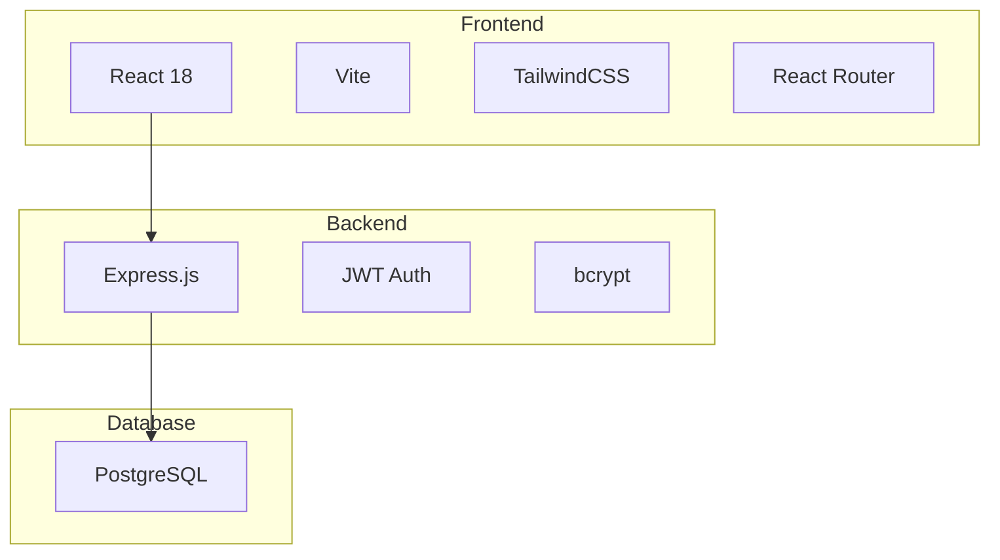
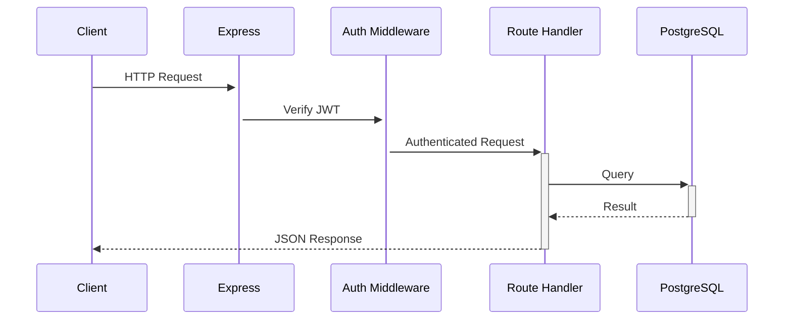

# 🏗️ Architecture

This document explains the high-level architecture of PlugOS.

## Overview

PlugOS follows a **monorepo** structure with a clear separation between frontend and backend:

```
PlugOS/
├── client/         # React frontend (Vite)
├── server/         # Express.js backend
└── docs/           # Documentation
```

## Tech Stack



## Frontend Architecture

### Directory Structure

```
client/src/
├── components/     # Reusable UI components
├── context/        # React Context providers
├── pages/          # Route page components
├── plugs/          # Plug-specific components
└── utils/          # Utility functions
```

### Key Components

| Component | Purpose |
|-----------|---------|
| `AuthContext` | Global authentication state |
| `Layout` | Main app shell with sidebar |
| `PrivateRoute` | Protected route wrapper |

## Backend Architecture

### Directory Structure

```
server/src/
├── config/         # Database & migrations
├── middleware/     # Express middleware
├── routes/         # API route handlers
└── schema/         # SQL schema files
```

### Request Flow



## Database Schema

### Core Tables

| Table | Purpose |
|-------|---------|
| `users` | User accounts |
| `organizations` | Tenant organizations |
| `org_members` | User-org relationships with roles |
| `departments` | Organization departments |
| `plugs` | Available plug registry |
| `org_plugs` | Enabled plugs per organization |

### Multi-Tenancy

PlugOS uses **shared database** multi-tenancy:
- All organizations share the same database
- Data is isolated via `org_id` foreign keys
- Department-level access control for plugs

## Plug System

### How Plugs Work

1. **Registry**: Available plugs are stored in the `plugs` table
2. **Enable/Disable**: Admins enable plugs per org via `org_plugs`
3. **Department Access**: `department_plugs` controls which departments see which plugs
4. **Frontend**: Plug components in `client/src/plugs/`
5. **Backend**: Plug routes in `server/src/routes/`

### Built-in Plugs

- **Employee Directory** - HR management
- **Attendance Tracker** - Time tracking
- **Payroll Manager** - Salary management
- **Document Manager** - File storage

## Security

- **Authentication**: JWT tokens with configurable expiry
- **Password Hashing**: bcrypt with salt
- **Authorization**: Role-based (admin/manager/employee)
- **Data Isolation**: Org-scoped queries throughout
